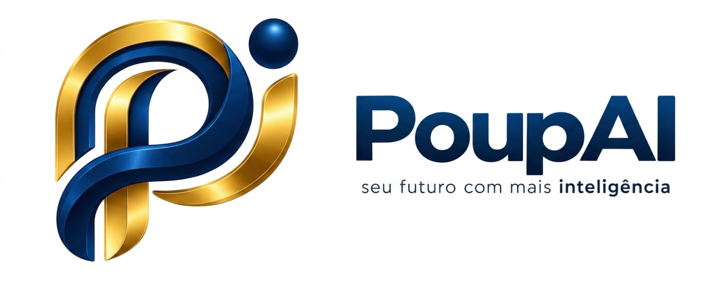
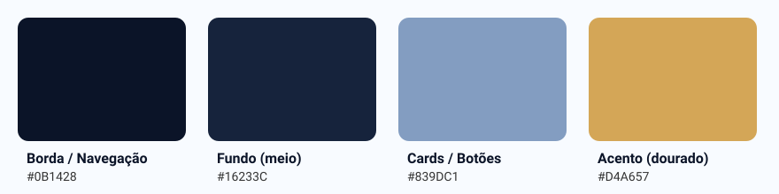

# PoupAI

App de fintech estudantil — controle financeiro pessoal, split de contas entre amigos e metas de economia, pensado pro ritmo de vida de quem vive de mesada, bolsa ou estágio.

Projeto avaliativo das Checkpoints 4, 5 e 6 da disciplina **CPAD (Cross-Platform Application Development)** — FIAP, turma 2CCPG.

<p>
  
  
</p>

## Integrantes — turma 2CCPG

| Nome | RM | Papel |
|---|---|---|
| André Nobrega | 561754 | Dev Flutter (estrutura/telas) |
| Caio Carminato | 563630 | Documentação |
| Guilherme Tamai | 563276 | Identidade visual/Design + Documentação |
| Mirella Mascarenhas | 562092 | Pitch/modelo de negócio |
| Vitor Komura | 563694 | Identidade visual/Design |

## Linha do tempo dos checkpoints

| Checkpoint | Foco | Status |
|---|---|---|
| [CP4 — Idealização](#cp4--idealização) | Proposta, marca, identidade visual, pitch e projeto Flutter inicial | Concluído |
| [CP5 — Protótipo funcional](#cp5--protótipo-funcional) | Telas navegáveis, banco de dados (Supabase), ambiente de teste e documentação | Concluído |
| [CP6 — App final](#cp6--app-final) | MVP completo, APK instalável e documentação de arquitetura | Em andamento |

---

# CP4 — Idealização

Entregáveis do CP4: proposta de valor e público-alvo, documentação inicial (problema e MVP), marca (nome, naming rationale e tom de voz), identidade visual, pitch e projeto Flutter inicial.

## Proposta de valor

Estudante universitário não tem ferramenta pensada pro seu tipo de gasto — apps de finanças existentes são feitos pra quem tem salário fixo, não pra quem vive de mesada, bolsa e divide conta de república toda semana. O **PoupAI** junta controle financeiro pessoal + split de contas em grupo + metas de economia, desenhado especificamente pro ritmo de vida universitário.

## Problema

Estudantes universitários têm dificuldade de controlar gastos pessoais e organizar despesas compartilhadas (contas de casa, saídas em grupo, rachar delivery/Uber) — normalmente resolvido de forma manual, via planilha ou "fiado" sem registro.

## Público-alvo

Estudantes universitários, moradores de república/kitnet, com renda limitada (mesada, estágio, bolsa) que dividem gastos com colegas com frequência.

## MVP (funcionalidades mínimas)

- Controle financeiro pessoal (registrar receitas/gastos, categorias)
- Split de contas entre grupo de amigos (quem deve pra quem)
- Metas de economia (definir meta, acompanhar progresso)
- Visão consolidada ("carteira") do saldo pessoal + pendências de split

## Marca

### Naming rationale

**PoupAI** une o verbo "poupar" (economizar, guardar dinheiro — termo já familiar em português) com "AI", sinalizando o lado inteligente do app: categorização automática de gastos, sugestões de meta, alertas de split pendente. O nome funciona por duplo motivo:

- É fácil de falar, lembrar e pronunciar tanto em português quanto em inglês
- "Poup" já carrega o significado central (economizar) sem precisar de explicação
- "AI" comunica diferencial tecnológico sem soar genérico como "finanças" ou "carteira"

### Tom de voz

O PoupAI fala como um amigo que entende de dinheiro, não como um banco. Diretrizes:

- **Direto, sem jargão financeiro** — "você deve R$ 32 pro grupo", não "saldo devedor pendente de liquidação"
- **Encorajador, nunca repreensivo** — o app não julga gasto, ajuda a organizar
- **Linguagem de estudante pra estudante** — humor leve permitido, formalidade excessiva não
- **Nunca alarmista** — alertas de saldo baixo são informativos, não geram culpa

## Identidade visual (CP4)

**Logo**

<p>
  
  
  
</p>

**Paleta**: borda/navegação `#0B1428` (azul quase-preto) · fundo `#16233C` (azul-marinho) · cards `#839DC1` (azul claro) · acento `#D4A657` (dourado)



**Tipografia**: Roboto (padrão Material/Flutter) — não houve escolha deliberada de fonte customizada nesta fase.

## Pitch

**Problema:** estudante universitário não tem ferramenta pensada pro seu tipo de gasto — apps de finanças existentes são feitos pra quem tem salário fixo, não pra quem vive de mesada, bolsa e divide conta de república toda semana.

**Solução:** o PoupAI junta controle financeiro pessoal + split de contas em grupo + metas de economia, desenhado especificamente pro ritmo de vida universitário (gasto irregular, muita divisão de conta, meta de curto prazo tipo "juntar pra viagem de formatura").

**Por que agora / por que nós:** somos o próprio público-alvo — vivemos o problema (dividir aluguel, conta de mercado, Uber em grupo) e sabemos exatamente onde as soluções atuais falham.

**Diferencial competitivo:**

| Apps genéricos (Mobills, Nubank) | PoupAI |
|---|---|
| Pensado pra salário fixo mensal | Pensado pra renda irregular (mesada/bolsa/estágio) |
| Split de conta é feature secundária ou inexistente | Split é funcionalidade central, não acessório |
| Metas genéricas | Metas de curto prazo, contexto universitário |

**Modelo de sustentação:** freemium — funcionalidades básicas (controle financeiro, split, metas) gratuitas; recursos avançados (relatórios detalhados, integração bancária) pagos. Alternativa considerada: parceria institucional com universidades/centros acadêmicos.

**Chamada final:** "PoupAI: a carteira pensada pra quem ainda não tem salário, mas já tem conta pra dividir."

## Projeto Flutter inicial (CP4)

Projeto Flutter criado e rodando, com as telas **Carteira**, **Split**, **Metas** e **Perfil**, navegação por abas e dados fixos no código (sem banco), aplicando a paleta do CP4.

---

# CP5 — Protótipo funcional

Foco: sair do papel, com telas navegáveis, dados de exemplo e rodando em ambiente de teste. O que mudou desde o CP4:

## O que foi entregue

| Entregável do CP5 | Situação |
|---|---|
| Protótipo funcional com dados de exemplo | App completo, com dados de exemplo realistas em `supabase/seed.sql` |
| Navegação entre telas (fluxo principal completo) | 4 abas, formulários de cadastro e detalhe do grupo |
| Integração de banco de dados | Supabase (Postgres) nas três áreas: Carteira, Metas e Split |
| Ambiente de teste configurado | Windows desktop e Chrome |
| Documentação atualizada | Este README: como rodar e decisões técnicas |

Fluxos implementados:

- **Carteira** — registrar receita ou despesa (com categoria); saldo e gráfico de gastos por categoria são calculados a partir dos dados.
- **Metas** — criar meta de economia com valor alvo; mostra porcentagem e quanto falta.
- **Split** — criar grupo, adicionar integrantes, registrar despesa dividida entre eles; saldo ("você deve" / "te devem") calculado a partir das despesas do grupo.

Verificado com `flutter analyze` sem avisos, `flutter test` (7 testes das regras de negócio), `flutter run -d windows` e `flutter run -d chrome --release`.

## Melhorias de UX e legibilidade

- Texto claro sobre o fundo escuro em todas as telas; dentro dos cards, texto escuro.
- Valores em reais no padrão brasileiro (`R$ 1.234,50`).
- Verde e vermelho dos valores escurecidos, porque os tons padrão ficavam ilegíveis sobre o card azul.
- Botões de salvar em dourado, campos de formulário com exemplos e prefixo `R$`.
- Telas vazias com ícone e orientação do que fazer; erros visíveis na tela com botão "Tentar de novo".
- Aviso curto ao salvar (receita registrada, meta criada, grupo criado).
- Gastos por categoria ordenados do maior para o menor; metas com barra de progresso e porcentagem.
- Logo oficial do PoupAI no app (antes era um "P" desenhado em código).

## Tema claro e escuro (CP5)

O app tem os dois temas, seguindo o padrão ensinado nas aulas 17 e 18 (`ThemeData` claro e escuro + `ThemeExtension` de paleta). Por padrão segue o tema do sistema; na aba **Perfil → Aparência** dá para forçar **Claro** ou **Escuro**.

| Uso | Tema escuro (identidade do CP4) | Tema claro |
|---|---|---|
| Barra superior e navegação | `#0B1428` | `#0B1428` |
| Fundo | `#16233C` | `#EEF2F8` |
| Cards | `#839DC1` | `#FFFFFF` (com contorno `#D3DDEC`) |
| Texto sobre o fundo | `#FFFFFF` | `#0B1428` |
| Acento (botões, logo) | `#D4A657` | `#D4A657` (ícones e foco usam `#8A5F0A`, para dar contraste no claro) |

O texto dentro dos cards é escuro nos dois temas.

## Como rodar

**Pré-requisitos:** Flutter SDK (3.x), Chrome, e um projeto no [Supabase](https://supabase.com) (gratuito).

**1. Instalar as dependências**

```bash
flutter pub get
```

**2. Criar o banco no Supabase**

No painel do projeto: **SQL Editor → New query**, colar o conteúdo de [`supabase/schema.sql`](./supabase/schema.sql) e clicar em **Run**. Isso cria as tabelas `movimentos`, `metas`, `grupos` e `despesas_grupo`.

Opcional, para a demonstração: rodar também [`supabase/seed.sql`](./supabase/seed.sql), que preenche o app com dados de exemplo realistas (receitas e despesas em 4 categorias, 3 metas em estágios diferentes e 3 grupos com despesas). **Atenção:** o script apaga os dados existentes das 4 tabelas antes de inserir.

**3. Configurar as credenciais**

Criar um arquivo `.env` na raiz do projeto (mesma pasta do `pubspec.yaml`):

```
SUPABASE_URL=https://SEU-PROJETO.supabase.co
SUPABASE_ANON_KEY=sua-chave-publishable-aqui
```

Os dois valores estão em **Project Settings → API Keys** no painel do Supabase. Use sempre a chave **publishable** (antiga `anon`). **Nunca** use a chave `secret`/`service_role` no app: ela dá acesso total ao banco e o Supabase bloqueia seu uso no navegador. O arquivo `.env` está no `.gitignore` e não deve ser commitado. Depois de editar o `.env`, é preciso reiniciar o app (hot restart), pois ele é carregado como asset.

**4. Rodar**

```bash
flutter run -d windows
```

No Windows, os plugins exigem o **Modo de Desenvolvedor** ativado (`start ms-settings:developers`); sem ele aparece `Building with plugins requires symlink support`. Alternativa no navegador:

```bash
flutter run -d chrome --release
```

O modo debug no Chrome (`flutter run -d chrome`) pode demorar ou travar em "Waiting for connection from debug service"; nesse caso, usar `--release`. Emulador Android pelo Android Studio também funciona, mas não é obrigatório.

**Testes**

```bash
flutter analyze
flutter test
```

## Decisões técnicas (CP5)

- **Supabase em vez de Firebase.** Os dados do app são relacionais (grupos têm despesas, despesas têm quem pagou) e o Supabase é Postgres, o que combina com esse modelo. O Firebase (NoSQL) exigiria duplicar dados para os mesmos cálculos de saldo.
- **Camada de serviço com interface.** Cada área do app (`Carteira`, `Metas`, `Split`) tem uma interface em `lib/services/` (`CarteiraService`, `MetasService`, `SplitService`) e duas implementações: uma com dados fixos (`Mock*Service`) e outra com o Supabase (`Supabase*Service`). As telas só conhecem a interface, então trocar a fonte de dados não exige mexer nas telas (inversão de dependência).
- **Operações de gravação assíncronas.** Os métodos `adicionar*` retornam `Future` e a tela só atualiza depois que o banco confirma. Uma versão anterior disparava o insert sem aguardar, e os dados sumiam ao recarregar a página.
- **Erros sempre visíveis.** Falha de rede ou de banco nunca fica só no console: as telas mostram mensagem com botão "Tentar de novo" (carregamento) ou aviso na tela (gravação).
- **Ids gerados pelo banco.** Todas as tabelas usam `uuid` gerado pelo Postgres; o app não inventa ids.
- **Tema claro e escuro.** As cores que mudam entre os temas vivem em uma `ThemeExtension` (`PoupAiPalette`), e as telas pedem `PoupAiPalette.of(context)` em vez de usar cores fixas. Dentro dos cards (`PoupCard`) o texto é sempre escuro.
- **Segurança (limitação consciente).** Como o app ainda não tem login de usuário, as políticas de RLS do Supabase estão abertas (`using (true)`): qualquer pessoa com a chave publishable lê e grava todos os dados. Isso é aceitável para este trabalho acadêmico, mas **não** para produção. Autenticação e políticas por usuário ficam para a evolução do projeto.

## Estrutura do projeto

```
lib/
├── main.dart            # inicialização (.env, Supabase) e navegação principal
├── core/theme/          # app_palette.dart (cores) e app_theme.dart (tema claro e escuro)
├── models/              # Movimento, Meta, Grupo, DespesaGrupo
├── services/            # interfaces + implementações mock e Supabase
├── screens/             # telas e formulários
├── widgets/             # PoupCard, estados vazio/erro, logo
└── utils/               # formatação de moeda
assets/                  # símbolo oficial do PoupAI usado no app
supabase/schema.sql      # tabelas e políticas do banco
supabase/seed.sql        # dados de exemplo para a demonstração
test/                    # testes das regras de negócio
```

---

# CP6 — App final

Em andamento. Escopo a ser fechado pelo grupo com base no edital da CP6: MVP completo, APK instalável testado (`flutter build apk --release`), documentação de arquitetura e aprendizados, e histórico de commits do repositório.
